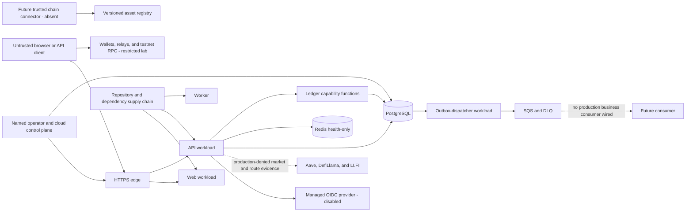

# Platform threat model and data classification

This is the human review view of KAN-49 / SEC-001. The authoritative,
machine-checked register is
[`threat-model-register.json`](threat-model-register.json), bound to the
lowercase SHA-256 value in
[`threat-model-register.sha256`](threat-model-register.sha256). The current
packet is ready for independent review; it is not a Security approval.

KAN-235 owns the independent decision. Its reviewer must remain independent of
the implementer and record `APPROVED`, `CONDITIONAL`, or `REJECTED` against the
exact Git commit SHA, Git tree SHA, and register SHA-256. The register hash alone
does not bind its evidence files or this narrative. Until then, no High or
Critical residual risk is locally accepted and no production, wallet,
identity-provider, chain-provider, or cloud boundary is enabled by this packet.

## Scope and method

The model covers customer account and authentication flows, the restricted
wallet-validation lab, the disabled-by-default local wallet-registration
boundary, supported-chain normalization, dormant smart-lending evidence egress,
immutable ledger and outbox processing, future administrator surfaces, secrets
and infrastructure, and repository/dependency provenance. It uses STRIDE as a
prompt, then records risk, response, implemented mitigations, residual risk,
accountable repository roles, evidence, and an explicit follow-up for every
threat.

The review must be repeated when a new public or administrator route, managed
identity provider, wallet connector, chain/RPC provider, financial operation,
data store, secret class, external destination, trust boundary, or retention
decision is introduced. A material control change requires a new model version
and fingerprint; a prior independent decision does not silently apply to a new
fingerprint.

The method follows the OWASP guidance to keep threat modeling continuous,
scope trust boundaries and data flows, and turn identified threats into
testable mitigations. The privacy treatment also follows OWASP's data
minimization and lifecycle guidance:

- [OWASP Threat Modeling Cheat Sheet](https://cheatsheetseries.owasp.org/cheatsheets/Threat_Modeling_Cheat_Sheet.html)
- [OWASP User Privacy Protection Cheat Sheet](https://cheatsheetseries.owasp.org/cheatsheets/User_Privacy_Protection_Cheat_Sheet.html)

## System and trust flow

The baseline boundary records live in the JSON register. The important
fail-closed distinctions are:

- the browser, wallet, forwarded headers, provider metadata, queue payloads,
  and future chain observations are untrusted;
- an account actor exists only after verified authentication, and account
  routes are self-scoped rather than request-selected;
- a verified wallet proof can establish only the authenticated account's
  chain-qualified registration ownership; wallet connection or signature is
  never an application login or transaction authorization;
- supported-asset identity proves an allowlisted `(network, contract/mint)`
  pair, not that a connector really observed that network;
- financial mutation crosses a purpose-bound database capability and immutable
  journal boundary; correlation metadata is never authority;
- no administrator product route exists, which is deny-by-absence rather than
  evidence of an approved administrator authorization design; and
- external egress remains deny-all until an exact destination and caller have
  an independently approved policy and cost/activation record. The dormant
  smart-lending transport fixes three destinations in code but rejects production
  activation. Its fixed Aave query contains no customer or wallet field, while
  LI.FI quote requests would disclose and link two wallet addresses,
  asset identities, and an exact amount, so they also require a specific
  privacy/processor decision rather than generic cross-chain opt-in.

## Data classification

| Level          | Meaning                                                                | Minimum handling                                                                                              |
| -------------- | ---------------------------------------------------------------------- | ------------------------------------------------------------------------------------------------------------- |
| `PUBLIC`       | Intentionally disclosable metadata                                     | Preserve integrity and provenance; never combine with customer or credential data.                            |
| `INTERNAL`     | Operational and review material                                        | Personnel/system need-to-know; no credentials, customer data, or private local paths.                         |
| `CONFIDENTIAL` | Operational or security-sensitive records                              | Least-privilege access, encrypted transport/storage, explicit allowlists, bounded retention.                  |
| `RESTRICTED`   | Customer, authentication, wallet, financial, audit, or secret metadata | Strongest application access controls, explicit lifecycle approval, no ordinary logs or unrestricted exports. |
| `PROHIBITED`   | Unauthorized copies of raw authority-granting secret material          | Never collect in business persistence, logs, analytics, source control, Jira, or review evidence.             |

The register maps 18 data assets to CIA impact, storage, logging treatment,
retention state, owner, and code evidence. Important examples are:

- account contact/residency, OIDC mapping, authentication state, ephemeral
  wallet proof material, durable encrypted wallet identity, rate-limit
  pseudonyms, immutable financial records, and domain audit records are
  `RESTRICTED`;
- raw nonce, signed-message, and signature values exist only in the restricted
  browser, wallet, or API verification process; application-held plaintext
  address/public-key and pairing state are session-bound, while vendor-managed
  retention remains unverified; challenge persistence contains versioned keyed
  digests and an AES-256-GCM sealed binding record while pending, never the raw
  nonce, signed message, or signature;
- durable registration stores the chain-qualified canonical address and
  server-authored metadata as versioned AES-256-GCM ciphertext, plus a
  purpose-separated versioned address digest used to enforce active ownership;
- the dormant LI.FI quote adapter would send Ethereum and Solana wallet
  addresses, asset identities, and an exact amount in a third-party query. It
  has no public route and rejects production activation; synthetic addresses
  only are permitted for an approved non-production exercise until disclosure,
  processor, retention, log-redaction, and data-subject lifecycle controls are
  reviewed;
- the dormant Aave adapter sends only a fixed Ethereum Core market address and
  chain ID. Its response is public market metadata, carries no authenticated
  block anchor, cannot establish recommendation eligibility, and remains
  production-denied pending egress and provider review;
- all smart-lending vendor requests and responses are governed as `RESTRICTED`
  because the dormant LI.FI path can link two customer wallets, assets, exact
  amounts, and lending intent even though the Aave and DefiLlama market queries
  themselves contain no customer data;
- actor-bearing structured operational logs, outbox records, and queue/DLQ
  messages are `RESTRICTED`; the current `ledger.journal-committed` payload and
  logging allowlists exclude contact data, wallet proof, credentials, amounts,
  balances, and raw provider payloads, while every future job kind still needs
  an explicit data-class schema before enablement;
- versioned supported-chain metadata is `PUBLIC` but integrity-sensitive; and
- seed phrases, private keys, runtime credential values, raw tokens, raw
  session secrets, and authority-granting signatures are `PROHIBITED`.

Hashing or encrypting a prohibited value does not make it safe to log or place
in review evidence. A digest may be persisted only where its exact
domain-separated verification purpose and lifecycle are part of an approved
boundary.

## Retention and deletion matrix

Validity expiry is not data deletion. The following table records what the
repository can prove and which decisions remain blocking.

| Store or class                                                          | Current local contract                                                                                                                                                                                                                                                                                                             | Pending policy or evidence                                                                                                                 |
| ----------------------------------------------------------------------- | ---------------------------------------------------------------------------------------------------------------------------------------------------------------------------------------------------------------------------------------------------------------------------------------------------------------------------------- | ------------------------------------------------------------------------------------------------------------------------------------------ |
| Raw credentials, tokens, wallet seeds/private keys, ledger capabilities | No copies in business persistence, logs, or review evidence; approved managed/provider/wallet custody or transient runtime only; persist purpose-separated digests where required                                                                                                                                                  | Rotation, revocation, overlap, compromise response, and secure-destruction procedures require approval and deployed evidence.              |
| Account profile and identity records                                    | Stored in PostgreSQL with self-scoped access; raw PII excluded from operational logs                                                                                                                                                                                                                                               | Deletion/DSAR, legal hold, archival, verification-state, and durable audit-retention periods are unapproved.                               |
| Authentication attempts, sessions, credentials, rate buckets, and audit | Raw browser values have TTL; database stores digests and replay tombstones                                                                                                                                                                                                                                                         | No purge/archive schedule exists for expired attempts, mappings, families, credentials, buckets, or audit rows.                            |
| Ledger, lifecycle, idempotency, and external evidence                   | Append-only and intentionally has no general deletion path                                                                                                                                                                                                                                                                         | Finance, Legal, Risk, Privacy, and Records must approve authoritative retention, archive, legal hold, close, and tamper-evidence policy.   |
| Published/terminal outbox rows                                          | Seven-day published and thirty-day failed defaults                                                                                                                                                                                                                                                                                 | Pending rows can remain indefinitely; future job kinds need a data-class allowlist before publication.                                     |
| SQS source queue and DLQ                                                | Four-day source and fourteen-day DLQ retention                                                                                                                                                                                                                                                                                     | Deployed encryption, access, redrive, deletion, and incident-query evidence is absent.                                                     |
| Structured operational logs                                             | Fourteen-day default, with a closed 1–90 day configured set                                                                                                                                                                                                                                                                        | Deployed delivery, KMS, access denial, search, export, and deletion evidence is absent; logs are never a financial/audit system of record. |
| RDS/Redis snapshots, managed secrets, and KMS keys                      | Templates retain protected state pending separately authorized deletion                                                                                                                                                                                                                                                            | Legal/business retention, deletion authority, key retirement, and cleanup evidence are unapproved.                                         |
| Wallet-lab evidence                                                     | Sanitized session storage or manual export, bound to a reviewed candidate                                                                                                                                                                                                                                                          | Vendor-managed storage/telemetry, downloaded-file deletion, and reviewer evidence retention are not enforced.                              |
| Wallet ownership challenge material                                     | Raw nonce, signed message, and signature are process-memory only; application plaintext address/public-key and pairing state are session-bound; PostgreSQL keeps keyed digests and a sealed binding record while pending, then row-locks, terminalizes, audits, and crypto-shreds the record when an expired challenge is prepared | Vendor retention, digest/replay-tombstone purge, deployed atomicity, incident retention, and key-overlap policy remain unapproved.         |
| Registered wallet identity and metadata                                 | Canonical address and server-authored metadata are AES-256-GCM encrypted with row-bound AAD; a versioned keyed digest enforces active identity uniqueness                                                                                                                                                                          | Revocation/deletion, legal hold, archive, decrypt access, re-encryption, and privacy retention remain unapproved.                          |
| Build and review artifacts                                              | Workflow-specific bounded artifact retention and Git history                                                                                                                                                                                                                                                                       | Final provenance/signing policy, reviewer access, and evidence retention require approval.                                                 |

Any implementation that deletes immutable financial or security evidence, or
retains customer data indefinitely, needs an explicit approved policy rather
than an inferred default.

## Secret and key inventory

The register inventories credential classes without storing usable values:
OIDC client authentication; OIDC identity HMAC; pre-authentication seal,
session, and CSRF keys; workload and migration database credentials; Redis ACL
passwords; AWS task credentials and KMS authority; TLS private keys; the
restricted wallet-lab access credential; the separate RDS bootstrap/master
credential; ledger capability and raw idempotency material; the local Jira API
credential; the ephemeral read-only GitHub Actions token; the optional
server-only LI.FI API credential; and three
purpose-distinct wallet-registration classes for canonical-identity HMAC,
challenge HMAC, and challenge-binding/address/metadata AES-256-GCM protection.

Every inventory row records consumers, injection boundary, storage form,
rotation requirement, accountable role, and repository evidence. The main open
items are production injection for the OIDC/authentication and wallet keys; a
compatible authentication key ring; a dual-digest wallet-identity migration;
challenge-HMAC overlap across unexpired and replay state; an additive wallet
decrypt key ring with authenticated reseal/rollback; live A/B credential
rotation and old-slot denial; LI.FI credential custody, rotation, revocation,
and processor approval; and independent inspection that runtime, log, and
review paths contain no usable values. Wallet registration is disabled by
default. Local tests generate non-production 32-byte fixtures in process; they
do not establish managed custody. KAN-50 custody and KAN-235 independent review
remain production gates.

## High-risk register summary

The canonical register's High-risk rows each have at least one
mitigation, owner, residual-risk statement, evidence path, and follow-up.

| Domain       | Local posture                                                                                                                                                              | Required next decision                                                                                                                                                 |
| ------------ | -------------------------------------------------------------------------------------------------------------------------------------------------------------------------- | ---------------------------------------------------------------------------------------------------------------------------------------------------------------------- |
| Account      | OIDC/PKCE, exact identity mapping, self-scope, cookies/CSRF/replay/rate limits are locally enforced                                                                        | Managed provider, MFA/recovery/logout, key rotation, deployed proxy/edge behavior, privacy and independent authorization review.                                       |
| Wallet       | Exact registry identity and a one-use, account/domain/network-bound EVM or Solana proof locally protect registration; smart-lending disclosure consent is separately bound | Independent real-wallet/privacy review, deployed key custody, trusted chain attestation, LI.FI processing/lifecycle controls, and separate login/transaction designs.  |
| Ledger       | Append-only journal controls plus fixed, strict, corroboration-only market/quote parsers are locally enforced; external feeds cannot authorize an action                   | Privileged tamper evidence, provider/finality/reorg/reconciliation, authenticated observations, deployment anchoring, divergence handling, and valuation/depeg policy. |
| Admin        | No product-admin surface is exposed; static cloud/database capability boundaries exist                                                                                     | FND-008/OPS authorization, lookup/masking, case integrity, immutable admin audit, break-glass, live IAM/database evidence, and explicit commercial authorization.      |
| Secrets      | History-aware source scanner, API/worker log allowlists, and workload-specific static boundaries                                                                           | Web/framework error-path coverage, runtime evidence, production auth-key injection/key ring, live rotation/revocation, and full-hop transport review.                  |
| Supply chain | Lockfiles, pinned actions, local validation, and candidate-bound evidence patterns                                                                                         | Independent dependency/image review and final-candidate provenance/attestation.                                                                                        |
| Availability | Bounded queue, parser, logging, rate-limit, retry, and DLQ primitives; dormant smart-lending reads add a shared deadline, abort, response limits, and candidate cap        | KAN-52 metrics/dashboard evidence plus per-account/global request and spend budgets, circuit breakers, caching, and deployed vendor/edge/load review.                  |

`MITIGATED_LOCAL` means a repository control and local test exist. It does not
mean the residual risk is accepted. `OPEN_FOLLOW_UP` means a named engineering
ticket must add the control. `OPEN_EXTERNAL` means a live, governance, vendor,
commercial, or independent-review decision cannot be manufactured locally.

## Review and approval gate

An independent KAN-235 reviewer must:

1. record and verify the exact Git commit SHA, Git tree SHA, and JSON register
   SHA-256;
2. confirm scope, boundaries, classifications, retention state, secret
   inventory, severity, owners, mitigations, and residual risks;
3. assign or approve one accountable DRI/role for every High/Critical row;
4. reject any unsupported `MITIGATED_LOCAL` claim;
5. record conditions and expiration/re-review triggers; and
6. issue an explicit decision without copying credentials, PII, wallet proof,
   or financial values into Jira or review evidence.

Changing the register invalidates its sidecar value. Changing any evidence,
validator, test, or narrative file changes the Git tree even if the register is
unchanged. Either change requires rebinding the independent review.

No step in this document authorizes cloud deployment, provider activation,
real-wallet use, external scanning, hosted load testing, paid review, or any
other billable action.
