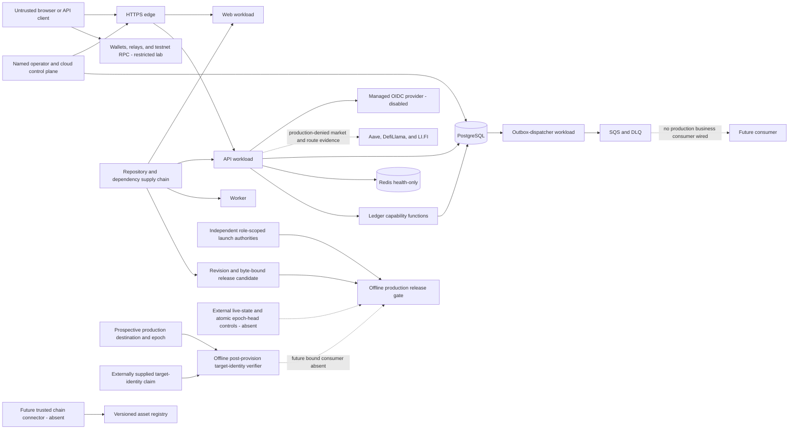

# Platform threat model and data classification

This is the human review view of KAN-49 / SEC-001. The authoritative,
machine-checked register is
[`threat-model-register.json`](threat-model-register.json), bound to the
lowercase SHA-256 value in
[`threat-model-register.sha256`](threat-model-register.sha256). The current
packet is ready for independent review; it is not a Security approval.

KAN-235 owns the independent decision. Its reviewer must remain independent of
the implementer and record `APPROVED`, `CONDITIONAL`, or `REJECTED` against the
exact Git commit SHA, Git tree SHA, and register SHA-256. The register hash alone
does not bind its evidence files or this narrative. Until then, no High or
Critical residual risk is locally accepted and no production, wallet,
identity-provider, chain-provider, or cloud boundary is enabled by this packet.

## Scope and method

The model covers customer account and authentication flows, the restricted
wallet-validation lab, the disabled-by-default local wallet-registration
boundary, supported-chain normalization, dormant smart-lending evidence egress,
immutable ledger and outbox processing, future administrator surfaces, secrets
and infrastructure, repository/dependency provenance, and candidate/target-bound
production evidence and launch-authority decisions. It uses STRIDE as a
prompt, then records risk, response, implemented mitigations, residual risk,
accountable repository roles, evidence, and an explicit follow-up for every
threat.

The review must be repeated when a new public or administrator route, managed
identity provider, wallet connector, chain/RPC provider, financial operation,
data store, secret class, external destination, trust boundary, or retention
decision is introduced. A material control change requires a new model version
and fingerprint; a prior independent decision does not silently apply to a new
fingerprint.

The method follows the OWASP guidance to keep threat modeling continuous,
scope trust boundaries and data flows, and turn identified threats into
testable mitigations. The privacy treatment also follows OWASP's data
minimization and lifecycle guidance:

- [OWASP Threat Modeling Cheat Sheet](https://cheatsheetseries.owasp.org/cheatsheets/Threat_Modeling_Cheat_Sheet.html)
- [OWASP User Privacy Protection Cheat Sheet](https://cheatsheetseries.owasp.org/cheatsheets/User_Privacy_Protection_Cheat_Sheet.html)

## System and trust flow

The baseline boundary records live in the JSON register. The important
fail-closed distinctions are:

- the browser, wallet, forwarded headers, provider metadata, queue payloads,
  and chain observations are untrusted;
- an account actor exists only after verified authentication, and account
  routes are self-scoped rather than request-selected;
- a verified wallet proof can establish only the authenticated account's
  chain-qualified registration ownership; wallet connection or signature is
  never an application login or transaction authorization;
- both Solana signature call sites reject noncanonical, identity, small-order,
  and mixed-order public points unless the decoded point is a nonidentity member
  of the Ed25519 prime-order subgroup before Node signature verification;
- supported-asset identity proves an allowlisted `(network, contract/mint)`
  pair, not that a connector really observed that network;
- financial mutation crosses a purpose-bound database capability and immutable
  journal boundary; correlation metadata is never authority;
- no administrator product route exists, which is deny-by-absence rather than
  evidence of an approved administrator authorization design; and
- external egress remains deny-all until an exact destination and caller have
  an independently approved policy and cost/activation record. The dormant
  smart-lending transport fixes three destinations in code but rejects production
  activation. Its fixed Aave query contains no customer or wallet field, while
  LI.FI quote requests would disclose and link two wallet addresses,
  asset identities, and an exact amount, so they also require a specific
  privacy/processor decision rather than generic cross-chain opt-in.
- release evidence is a separate trust boundary: a signed statement is useful
  only when it is current, role-scoped, independently corroborated where
  required, and bound to the exact verified candidate manifest, production
  destination epoch, target identity, and technical-evidence bundle digest. A
  `CLAIMED_INERT_DEPLOYED` target-identity enrollment authenticates a bounded
  claim; it is not a live-state observation or deployment authority. The
  checked-in destination, deployed-target, enrollment-authority, and other
  production authority registries are empty, so no local artifact can currently
  manufacture a production approval.

## Data classification

| Level          | Meaning                                                                | Minimum handling                                                                                              |
| -------------- | ---------------------------------------------------------------------- | ------------------------------------------------------------------------------------------------------------- |
| `PUBLIC`       | Intentionally disclosable metadata                                     | Preserve integrity and provenance; never combine with customer or credential data.                            |
| `INTERNAL`     | Operational and review material                                        | Personnel/system need-to-know; no credentials, customer data, or private local paths.                         |
| `CONFIDENTIAL` | Operational or security-sensitive records                              | Least-privilege access, encrypted transport/storage, explicit allowlists, bounded retention.                  |
| `RESTRICTED`   | Customer, authentication, wallet, financial, audit, or secret metadata | Strongest application access controls, explicit lifecycle approval, no ordinary logs or unrestricted exports. |
| `PROHIBITED`   | Unauthorized copies of raw authority-granting secret material          | Never collect in business persistence, logs, analytics, source control, Jira, or review evidence.             |

The register maps 19 data assets to CIA impact, storage, logging treatment,
retention state, owner, and code evidence. Important examples are:

- account contact/residency, OIDC mapping, authentication state, ephemeral
  wallet proof material, durable encrypted wallet identity, rate-limit
  pseudonyms, immutable financial records, and domain audit records are
  `RESTRICTED`;
- raw nonce, signed-message, and signature values exist only in the restricted
  browser, wallet, or API verification process; application-held plaintext
  address/public-key and pairing state are session-bound, while vendor-managed
  retention remains unverified; challenge persistence contains versioned keyed
  digests and an AES-256-GCM sealed binding record while pending, never the raw
  nonce, signed message, or signature;
- durable registration stores the chain-qualified canonical address and
  server-authored metadata as versioned AES-256-GCM ciphertext, plus a
  purpose-separated versioned address digest used to enforce active ownership;
- the dormant LI.FI quote adapter would send Ethereum and Solana wallet
  addresses, asset identities, and an exact amount in a third-party query. It
  has no public route and rejects production activation; synthetic addresses
  only are permitted for an approved non-production exercise until disclosure,
  processor, retention, log-redaction, and data-subject lifecycle controls are
  reviewed;
- the dormant Aave GraphQL adapter sends only a fixed Ethereum Core market
  address and chain ID. Its response is public market metadata, carries no
  authenticated block anchor, cannot establish recommendation eligibility, and
  remains production-denied pending egress and provider review;
- the separate Aave Ethereum deployment-evidence boundary has no configured RPC
  endpoint and is unavailable by default. Its closed plan fixes the network,
  finalized-block selector, required EIP-1898 binding, immutable address-book
  revision, contract targets, read methods, and ABI calls. Its parser checks
  source-attested per-operation bindings, header consistency, runtime-code
  presence, observed proxy implementation, provider, DataProvider, USDC, and
  USDT relationships, while approved code hashes, authenticated live sources,
  and live finality remain unverified and non-authoritative;
- its dormant two-source coordinator revalidates each evidence fingerprint and
  compares the complete finalized header, eight runtime-code hashes, and USDC/
  USDT reserve topology. A separate unregistered PostgreSQL repository records
  source-scoped append-only decisions, preserves last-good facts, and latches
  divergence quarantine. Bounded continuity backfill and quarantine recovery
  require two distinct agreeing sources for every contiguous block and a
  single-use authorization bound to the locked current state; no component
  proves source independence or live finality, and none is registered for
  runtime use;
- dormant provider-position contracts require complete, agreeing, current,
  fingerprint-bound coverage for every exact wallet and approved-market target
  before an empty position set can mean zero. Conservative composition keeps
  provider/market/position identity, counts liquid and supplied assets, and
  treats borrow positions only as liabilities; no live reader is registered;
- the closed outer schema-v3 `READ_ONLY` technical-evidence bundle and v3
  signing domain cover one schema-v2 live-read index with the exact ordered ten
  providers and one schema-v1 provider record for each fixed Ethereum or Solana
  tuple. Each provider record binds deployment/runtime/market identity, asset,
  oracle, pause/cap, code, source-pair, finality/freshness, fail-closed adapter,
  sanitized-capture, risk, operations, and independent-acceptance evidence.
  This is an attestation carrier only: its hashes and references do not query a
  live chain, open retained captures, authenticate a source operator, prove
  source independence, or prove that a referenced decision or exercise
  occurred, and the production signer registry remains empty;
- all smart-lending vendor requests and responses are governed as `RESTRICTED`
  because the dormant LI.FI path can link two customer wallets, assets, exact
  amounts, and lending intent even though the Aave and DefiLlama market queries
  themselves contain no customer data;
- actor-bearing structured operational logs, outbox records, and queue/DLQ
  messages are `RESTRICTED`; new outbox rows are limited to three reviewed,
  versioned job contracts with exact payload, attribute, destination, semantic
  binding, classification, and retention rules. Those contracts and logging
  allowlists exclude contact data, wallet proof, credentials, unrestricted
  amounts or balances, and raw provider payloads; an unknown kind or version
  cannot be inserted through the application repository;
- versioned supported-chain metadata is `PUBLIC` but integrity-sensitive; and
- release manifests, deployment-target records, and canonical signed decisions
  are `INTERNAL` integrity-critical evidence. They must contain bounded public
  identifiers and digests only, never credentials, private signing material,
  customer data, or private local paths; and
- seed phrases, private keys, runtime credential values, raw tokens, raw
  session secrets, and authority-granting signatures are `PROHIBITED`.

Hashing or encrypting a prohibited value does not make it safe to log or place
in review evidence. A digest may be persisted only where its exact
domain-separated verification purpose and lifecycle are part of an approved
boundary.

## Retention and deletion matrix

Validity expiry is not data deletion. The following table records what the
repository can prove and which decisions remain blocking.

| Store or class                                                          | Current local contract                                                                                                                                                                                                                                                                                                             | Pending policy or evidence                                                                                                                                                         |
| ----------------------------------------------------------------------- | ---------------------------------------------------------------------------------------------------------------------------------------------------------------------------------------------------------------------------------------------------------------------------------------------------------------------------------- | ---------------------------------------------------------------------------------------------------------------------------------------------------------------------------------- |
| Raw credentials, tokens, wallet seeds/private keys, ledger capabilities | No copies in business persistence, logs, or review evidence; approved managed/provider/wallet custody or transient runtime only; persist purpose-separated digests where required                                                                                                                                                  | Rotation, revocation, overlap, compromise response, and secure-destruction procedures require approval and deployed evidence.                                                      |
| Account profile and identity records                                    | Stored in PostgreSQL with self-scoped access; raw PII excluded from operational logs                                                                                                                                                                                                                                               | Deletion/DSAR, legal hold, archival, verification-state, and durable audit-retention periods are unapproved.                                                                       |
| Authentication attempts, sessions, credentials, rate buckets, and audit | Raw browser values have TTL; database stores digests and replay tombstones                                                                                                                                                                                                                                                         | No purge/archive schedule exists for expired attempts, mappings, families, credentials, buckets, or audit rows.                                                                    |
| Ledger, lifecycle, idempotency, and external evidence                   | Append-only and intentionally has no general deletion path                                                                                                                                                                                                                                                                         | Finance, Legal, Risk, Privacy, and Records must approve authoritative retention, archive, legal hold, close, and tamper-evidence policy.                                           |
| Published/terminal outbox rows                                          | Seven-day published and thirty-day failed defaults; new rows require one of three reviewed, versioned, destination-bound data-class contracts                                                                                                                                                                                      | Pending rows can remain indefinitely; deployed retention/purge evidence and independent approval of every future contract remain required.                                         |
| SQS source queue and DLQ                                                | Four-day source and fourteen-day DLQ retention                                                                                                                                                                                                                                                                                     | Deployed encryption, access, redrive, deletion, and incident-query evidence is absent.                                                                                             |
| Structured operational logs                                             | Fourteen-day default, with a closed 1–90 day configured set                                                                                                                                                                                                                                                                        | Deployed delivery, KMS, access denial, search, export, and deletion evidence is absent; logs are never a financial/audit system of record.                                         |
| RDS/Redis snapshots, application-managed secrets, and KMS keys          | Templates retain protected state pending separately authorized deletion                                                                                                                                                                                                                                                            | Legal/business retention, deletion authority, key retirement, and cleanup evidence are unapproved.                                                                                 |
| RDS-managed master secret                                               | RDS owns the secret and ties its ARN and deletion lifecycle to the database; the template retains no independent copy. A closed nested schema-v1 lifecycle record and supporting-capture digest covered by the outer two-role-signed schema-v3 bundle, plus a fail-closed preflight blocker, exist locally                         | Acceptable deployed rotation, replacement, snapshot-restore, ARN-rebinding, old-password-denial, capture retention/matching, and cleanup evidence remains absent.                  |
| Wallet-lab evidence                                                     | Sanitized session storage or manual export, bound to a reviewed candidate                                                                                                                                                                                                                                                          | Vendor-managed storage/telemetry, downloaded-file deletion, and reviewer evidence retention are not enforced.                                                                      |
| Wallet ownership challenge material                                     | Raw nonce, signed message, and signature are process-memory only; application plaintext address/public-key and pairing state are session-bound; PostgreSQL keeps keyed digests and a sealed binding record while pending, then row-locks, terminalizes, audits, and crypto-shreds the record when an expired challenge is prepared | Vendor retention, digest/replay-tombstone purge, deployed atomicity, incident retention, and key-overlap policy remain unapproved.                                                 |
| Registered wallet identity and metadata                                 | Canonical address and server-authored metadata are AES-256-GCM encrypted with row-bound AAD; a versioned keyed digest enforces active identity uniqueness                                                                                                                                                                          | Revocation/deletion, legal hold, archive, decrypt access, re-encryption, and privacy retention remain unapproved.                                                                  |
| Build and review artifacts                                              | Workflow-specific bounded artifact retention and Git history                                                                                                                                                                                                                                                                       | Final provenance/signing policy, reviewer access, and evidence retention require approval.                                                                                         |
| Release candidate, target-identity enrollment, and launch decisions     | Canonical manifests, signed target-identity claims, and decisions are candidate-, destination-epoch-, target-, role-, and expiry-bound; production destination, target, enrollment-authority, and other authority registries are empty                                                                                             | Trusted CI packaging, live deployed-state verification, atomic epoch/head consumption, private-key custody, revocation, evidence retention, and independent acceptance are absent. |

Any implementation that deletes immutable financial or security evidence, or
retains customer data indefinitely, needs an explicit approved policy rather
than an inferred default.

## Secret and key inventory

The register inventories credential classes without storing usable values:
ephemeral OIDC public-client PKCE/authorization transaction secrets; OIDC
identity HMAC; pre-authentication seal, session, and CSRF keys; workload and
migration database credentials; Redis ACL passwords; AWS task credentials and
KMS authority; TLS private keys; the restricted wallet-lab access credential;
the separate RDS-managed bootstrap/master credential; ledger capability and
raw idempotency material; the local Jira API credential; the ephemeral
read-only GitHub Actions token; the optional
server-only LI.FI API credential; and three
purpose-distinct wallet-registration classes for canonical-identity HMAC,
challenge HMAC, and challenge-binding/address/metadata AES-256-GCM protection.
The inventory also records the externally custodied Ed25519 keys that would
sign deployment intents, post-provision target-identity enrollments, transition
records, technical evidence, and seven distinct public-launch authority
decisions. Only public verification keys may ever enter the repository, and
those production registries are currently empty.

Every inventory row records consumers, injection boundary, storage form,
rotation requirement, accountable role, and repository evidence. The
zero-desired-count API task definition now contains exact external-secret field
selectors for `AUTH_PREAUTH_SEAL_KEY` and all six purpose-distinct
authentication and wallet key-ring documents, all pinned to one immutable
Secrets Manager VersionId with an empty stage, without provisioning or reading
any key. It requires `NODE_ENV=production`, omits `LOCAL_DEMO_MODE`, rejects the
legacy authentication ID/key and wallet version/key pairs, and remains disabled
by default at zero desired tasks. The guard preserves the deployed shared-secret
ARN/VersionId/KMS tuple during ordinary and fixed-slot updates. A separate
two-role-signed offline guard now validates no-op adoption and one-purpose
auth/wallet VersionId transitions, and the deployment wrapper binds its verified
report, signed predecessor, authority-registry digest, deployed chain head, and
exact API task replacement/service update. Its production authority registry is
intentionally empty. The main open items are externally controlled trust
anchors, deployed managed custody, authorized key population, live captures,
independent approval, and rotation evidence for those external keys; activation
and deployed exercise of the dormant bounded authentication HMAC key rings and
identity-alias migration; activation of the migration-`0022` wallet-identity
policy; an exercised challenge-HMAC overlap across unexpired and replay state;
activation and review of the dormant schema-owner-only wallet address/metadata
rewrap workflow added by migration `0024`; live A/B credential
rotation and old-slot denial; LI.FI credential custody, rotation, revocation,
and processor approval; and independent inspection that runtime, log, and
review paths contain no usable values. Wallet registration is disabled by
default. Local tests generate non-production 32-byte fixtures in process; they
do not establish managed custody. KAN-50 custody and KAN-235 independent review
remain production gates.

Every locally implemented production authority-registry parser now decodes the
raw Ed25519 point and rejects noncanonical encodings, the identity, all
small-order points, and canonical mixed-order points that fail the
`[L]P = identity` prime-subgroup check before handing a key to Node's
cryptographic verifier. This covers the auth/wallet transition,
balance-consumer metadata transition, Redis-operator transition, deployment
intent, deployment target-identity enrollment, technical-evidence, and
public-launch decision registries. The API has a build-local implementation of
the same point check for Solana wallet-registration proofs and public-testnet
submission signatures. Deterministic tests cover RFC 8032 keys, torsion and
mixed-order points, and the identity-key `R = identity, S = 0` forgery at both
callers. This closes that public-key admission flaw locally; it does not
authenticate who controls an admitted production key or establish private-key
custody, separation, issuance, rotation, revocation, or compromise response.

The pure offline post-provision target-identity enrollment verifier separately
requires canonical bytes, short application-time freshness, distinct
deployment-owner and independent-security keys, and exact bindings to a branded
prospective destination ID, destination hash, nonzero epoch and registry hash;
the provision intent, reservation, and result identities; the source revision
and release-manifest digest; and the complete deployed-target identity. It also
checks account, Region, CloudFormation stack, and public-origin continuity. Its
`CLAIMED_INERT_DEPLOYED` value and `INERT_DEPLOYED_UNVERIFIED` report field are
deliberately claims, not live observations. Its production authority registry
is empty, and the module performs no network, cloud, environment, subprocess,
filesystem-write, deployment, state, chain-head, or external-authority action.

A future externally controlled consumer must revalidate the report and its
freshness, match every provision/reservation/result/source/release binding,
obtain separately branded live post-state evidence, and use a strongly
consistent chain store to reserve and atomically consume the destination epoch
and predecessor head. Monotonic fencing, emergency-kill preemption, stale-worker
checks before and after external calls, and idempotent reconciliation of
ambiguous outcomes are also absent. Until those controls exist and are
exercised, a signed target identity cannot authorize execution or establish an
applied deployment state.

Redis credentials now follow the same immutable-selection principle without
merging their lifecycles. Six database/API-Redis A/B slots use exact stage-free VersionIds and
the reviewed adjacent transition chain. The disabled operator Redis user and
one-off revocation task share a seventh exact VersionId captured during inert
schema-v3 adoption together with its singleton append-only history;
`AWSCURRENT`, omitted selectors, mixed pins, and later changes through the A/B
or application update paths fail closed. A dedicated two-role-signed offline
Redis-operator validator and deployment intent now constrain no-op chain
adoption and one exact fresh VersionId append while the operator remains
disabled and its task remains absent. They preserve every A/B slot and the
auth/wallet chain and advance the Redis-specific and composite credential chains
together. The production authority registry is intentionally empty. Live secret
generation and custody, independently signed operational records, backend
installation, candidate and old-credential authentication, task execution,
continuity/recovery, denial evidence, independent approval, and deployment
remain external gates; no password has been staged or rotated and no AWS or
Redis operation has been run.

The RDS master credential intentionally does not use that immutable selector or
transition chain. RDS generates and owns the `crypto_admin` password and
Secrets Manager secret, encrypts it with the application data customer-managed
KMS key, and rotates it every seven days by default. The application template
keeps an ARN-only `DatabaseCredentialsSecretArn` compatibility output but gives
no task the credential. Live bootstrap-only IAM and KMS access, rotation state,
master-session drain, new-authentication/old-password-denial evidence, and
database deletion/replacement/snapshot-restore rebinding remain external gates
because the managed secret follows the database lifecycle. The closed nested
schema-v1 `rdsMasterLifecycleEvidence` record is covered by the outer
two-role-signed schema-v3 bundle and binds the primary and restored database,
managed-secret, VersionId, compatibility-output, and KMS identities and requires
exact `PASS` results for
bootstrap IAM/KMS, application and migration isolation, session drain, managed
rotation, new authentication, old-password denial, runtime continuity, and
restore/rebinding. Its primary database ARN/resource ID, managed-secret ARN, and
application-key ARN must equal the schema-v2 deployment target's closed `rds`
block; the outer signatures also cover the v2 target digest, which includes the
CloudFormation stack ID. Primary,
rotation, and rebound secret status must be `active`; rotation uses distinct
`AWSPREVIOUS`/`AWSCURRENT` VersionIds and restore uses an `AWSCURRENT` rebound
version.

Closed schema-v1 `supportingCapture` metadata commits to a separately retained
`RDS_MASTER_LIFECYCLE_CAPTURE` in `SANITIZED_CANONICAL_JSON_V1` format by
`captureSha256` and a bounded, ordered collection/access/rotation/restore
timeline. The bundle validator checks metadata, digest shape, statuses, stages,
and time order, but does not open that capture file. Both signing roles must
independently calculate and match the canonical capture digest before signing
the outer bundle. Repository/no-bundle, absent, forged, or unbranded input emits
`RDS_MASTER_LIFECYCLE_EVIDENCE_MISSING`; malformed, already stale, or counterfeit
bundle material is rejected during load/application as sanitized
`PRODUCTION_PREFLIGHT_EVIDENCE_BUNDLE_INVALID`, before any report. Previously
accepted evidence that later becomes stale restores the RDS blocker during
evaluation and can additionally produce
`PUBLIC_LAUNCH_AUTHORITY_DECISION_UNVERIFIED` when a launch decision is bound.
This is a signed attestation carrier, not a cloud probe; no acceptable live
record or capture exists today. The record and capture permit operational
identifiers only, never passwords, `SecretString`, connections, or logs, and
neither is checked into Git or Jira.

## High-risk register summary

The canonical register's High-risk rows each have at least one
mitigation, owner, residual-risk statement, evidence path, and follow-up.

| Domain       | Local posture                                                                                                                                                                                                                                                                                                                                                                                                                                                                                      | Required next decision                                                                                                                                                                                                                                                                                                                                                                   |
| ------------ | -------------------------------------------------------------------------------------------------------------------------------------------------------------------------------------------------------------------------------------------------------------------------------------------------------------------------------------------------------------------------------------------------------------------------------------------------------------------------------------------------- | ---------------------------------------------------------------------------------------------------------------------------------------------------------------------------------------------------------------------------------------------------------------------------------------------------------------------------------------------------------------------------------------- |
| Account      | OIDC/PKCE, exact identity mapping, self-scope, cookies/CSRF/replay/rate limits, and dormant bounded identity/session/CSRF HMAC overlap are locally enforced                                                                                                                                                                                                                                                                                                                                        | Managed provider, MFA/recovery/logout, external key custody, deployed rotation, proxy/edge behavior, privacy, and independent authorization review.                                                                                                                                                                                                                                      |
| Wallet       | Exact registry identity and a one-use, account/domain/network-bound EVM or Solana proof locally protect registration; both Solana signature callers require canonical nonidentity prime-subgroup public points before Node verification; a dormant, audited, atomic rewrap state machine rejects runtime callers and unsafe ciphertext mutation                                                                                                                                                    | Independent real-wallet/privacy review, deployed key custody, a dedicated schema-owner rewrap workflow and drill, trusted chain attestation, LI.FI processing/lifecycle controls, and separate login/transaction designs.                                                                                                                                                                |
| Ledger       | Append-only journal controls, deterministic conservative valuation, strict corroboration-only parsers, exact provider-position coverage, full-state two-source comparison, guarded append-only finalized-checkpoint recovery, and a closed schema-v3/v2/v1 provider-evidence carrier are locally enforced; external feeds and signed references cannot authorize an action or prove live/source-independent observations                                                                           | Privileged tamper evidence, approved live providers/readers and independently controlled source pairs, durable depeg-latch authorization, generic reorg/unknown-outcome reconciliation, deployment anchoring, and live exercises.                                                                                                                                                        |
| Admin        | No product-admin surface is exposed; static cloud/database capability boundaries exist                                                                                                                                                                                                                                                                                                                                                                                                             | FND-008/OPS authorization, lookup/masking, case integrity, immutable admin audit, break-glass, live IAM/database evidence, and explicit commercial authorization.                                                                                                                                                                                                                        |
| Secrets      | History-aware source scanning, API/worker/Next.js Node error-path log allowlists, three exact reviewed outbox contracts, workload-specific static boundaries, one immutable shared-secret VersionId across all seven auth/wallet selectors, deployment-integrated two-role transition guards, production authority-registry Ed25519 prime-subgroup validation, an RDS-managed KMS-bound master credential excluded from tasks, and a two-role-signed fail-closed RDS lifecycle/capture-digest gate | Authorized external secret staging, production trust anchors and independently signed records, deployed framework/runtime evidence, acceptable RDS master rotation/restore proof and independently matched capture, signing-key custody, live rotation/revocation and candidate/old-credential denial, database-bypass review, third-party handling, and full-hop transport review.      |
| Supply chain | Lockfiles, pinned actions, local validation, a byte-inventory manifest, prospective destination/epoch binding, schema-v2 deployment-target identity hashing, a fail-closed offline two-role target-identity enrollment verifier, and role-separated evidence/decision formats                                                                                                                                                                                                                      | Close the manifest filesystem/CI review, then obtain independent dependency/image review, production key/destination enrollment and signed target-identity evidence, separate live-state proof, strongly consistent atomic epoch/head CAS with fencing and reconciliation, external role decisions, final-candidate provenance, deployment digest verification, and revocation evidence. |
| Availability | Bounded queue, parser, logging, rate-limit, retry, and DLQ primitives; templates add queue-age/DLQ alarms, exact ALARM/OK notification binding, and an operational dashboard; dormant smart-lending reads add a shared deadline, abort, response limits, and candidate cap                                                                                                                                                                                                                         | Authorized topic/subscriptions, escalation ownership, per-account/global request and spend budgets, circuit breakers, caching, plus deployed queue/vendor/edge/load exercises.                                                                                                                                                                                                           |

`MITIGATED_LOCAL` means a repository control and local test exist. It does not
mean the residual risk is accepted. `OPEN_FOLLOW_UP` means a named engineering
ticket must add the control. `OPEN_EXTERNAL` means a live, governance, vendor,
commercial, or independent-review decision cannot be manufactured locally.

## Review and approval gate

An independent KAN-235 reviewer must:

1. record and verify the exact Git commit SHA, Git tree SHA, and JSON register
   SHA-256;
2. confirm scope, boundaries, classifications, retention state, secret
   inventory, severity, owners, mitigations, and residual risks;
3. assign or approve one accountable DRI/role for every High/Critical row;
4. reject any unsupported `MITIGATED_LOCAL` claim;
5. record conditions and expiration/re-review triggers; and
6. issue an explicit decision without copying credentials, PII, wallet proof,
   or financial values into Jira or review evidence.

Changing the register invalidates its sidecar value. Changing any evidence,
validator, test, or narrative file changes the Git tree even if the register is
unchanged. Either change requires rebinding the independent review.

No step in this document authorizes cloud deployment, provider activation,
real-wallet use, external scanning, hosted load testing, paid review, or any
other billable action.
